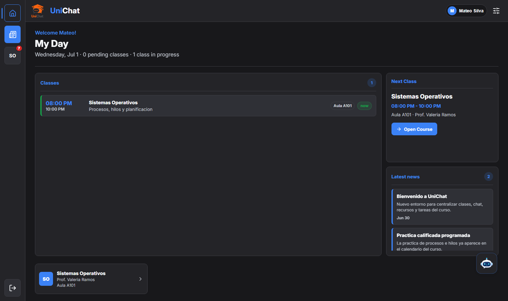
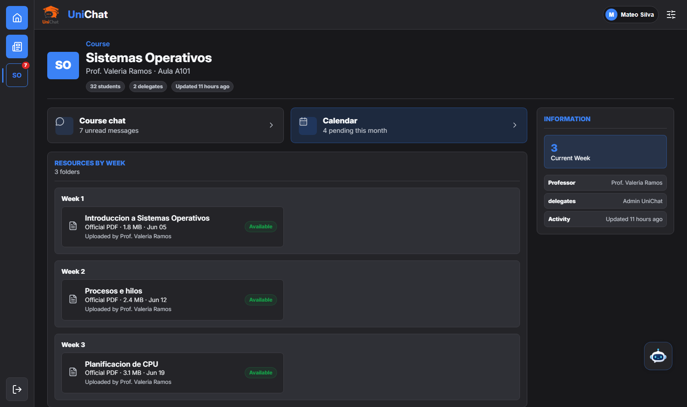
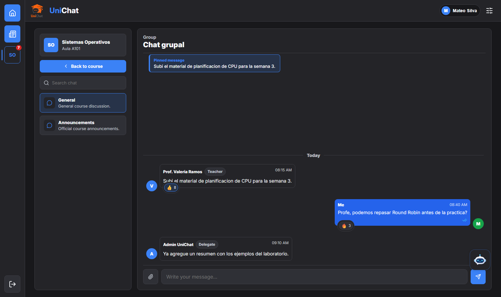
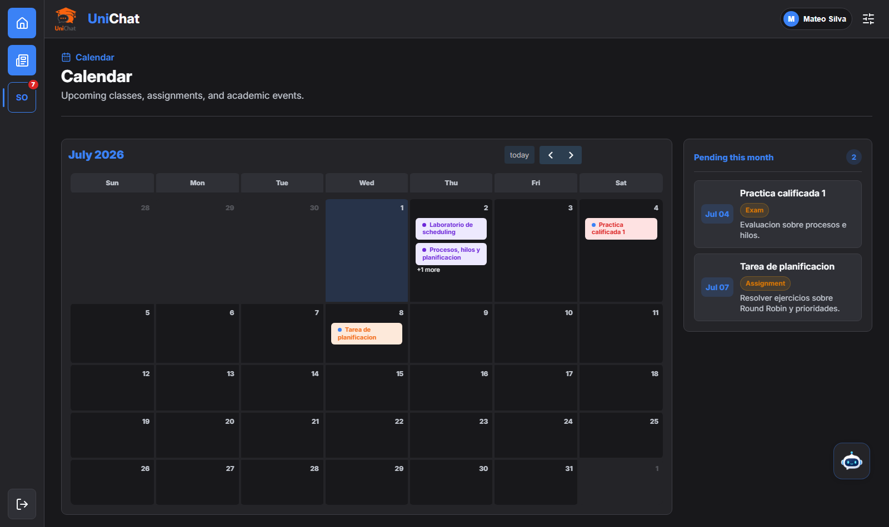
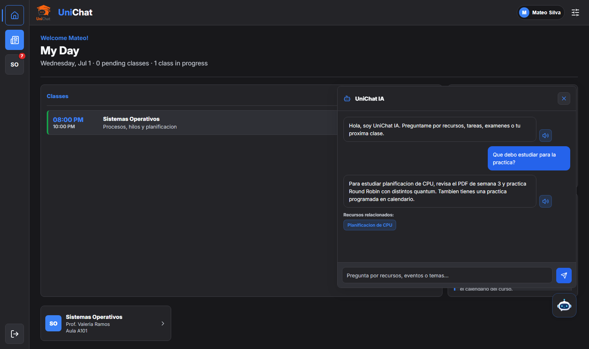
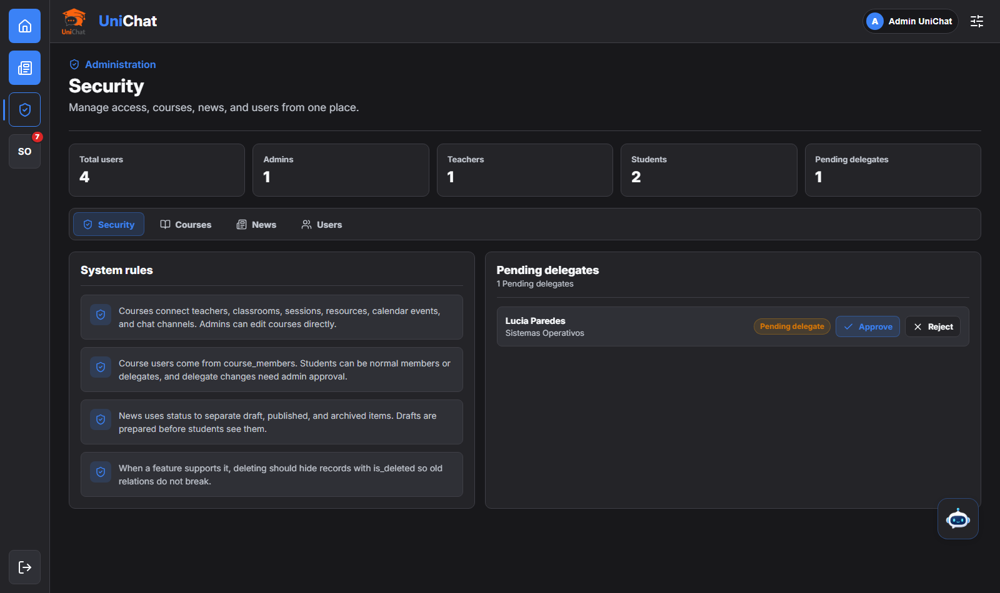

<div align="center">
  

  <h1>UniChat</h1>

  <p>
    A full-stack university learning hub with realtime course chat, resources, calendars,
    admin workflows, AI answers, and voice playback.
  </p>

  <p>
    
    
    
    
    
  </p>
</div>

<p align="center">
  
</p>

<p align="center">
  <a href="docs/README.md"><strong>Documentation</strong></a>
  ·
  <a href="docs/ARCHITECTURE.md"><strong>Architecture</strong></a>
  ·
  <a href="docs/DOCKER.md"><strong>Docker</strong></a>
  ·
  <a href="docs/DEVELOPMENT.md"><strong>Development</strong></a>
  ·
  <a href="docs/DEPLOYMENT.md"><strong>Deployment</strong></a>
</p>

---

## Product

UniChat turns a course into a single workspace: students see classes and news, teachers manage resources and calendar events, course members chat in realtime, and admins control users, courses, announcements, and delegate approvals.

<table>
  <tr>
    <td width="50%">
      
      <strong>Course workspace</strong><br />
      Resources, course metadata, weekly files, delegates, and quick actions.
    </td>
    <td width="50%">
      
      <strong>Realtime chat</strong><br />
      Channels, pinned messages, read checks, reactions, locks, and attachments.
    </td>
  </tr>
  <tr>
    <td width="50%">
      
      <strong>Calendar</strong><br />
      Class sessions, exams, reminders, assignments, and teacher actions.
    </td>
    <td width="50%">
      
      <strong>AI assistant</strong><br />
      Course-aware answers with related resources and Amazon Polly voice playback.
    </td>
  </tr>
  <tr>
    <td width="50%">
      
      <strong>Admin console</strong><br />
      Course, user, news, security rules, and delegate approval workflows.
    </td>
    <td width="50%">
      
      <strong>Daily dashboard</strong><br />
      Current classes, next class, latest news, and course shortcuts.
    </td>
  </tr>
</table>

## Highlights

<table>
  <tr>
    <td><strong>Realtime learning</strong></td>
    <td>Socket.IO course channels with reactions, pinned messages, read tracking, and teacher locks.</td>
  </tr>
  <tr>
    <td><strong>Academic workflow</strong></td>
    <td>Resources by week, calendar events, class sessions, news, delegates, and role-based actions.</td>
  </tr>
  <tr>
    <td><strong>AI layer</strong></td>
    <td>OpenAI-backed assistant for course questions, resource discovery, exams, tasks, and study help.</td>
  </tr>
  <tr>
    <td><strong>Voice playback</strong></td>
    <td>Amazon Polly synthesis for AI answers, with client-side audio caching and controls.</td>
  </tr>
  <tr>
    <td><strong>Production-minded stack</strong></td>
    <td>Docker Compose, nginx proxy, PostgreSQL volumes, typed backend, typed frontend, and persisted uploads.</td>
  </tr>
</table>

## Stack

```text
Frontend     React 19 · Vite 8 · TypeScript · React Router · FullCalendar
Backend      Node.js 20 · Express 5 · TypeScript · Socket.IO · JWT
Database     PostgreSQL 16 · SQL schema · typed seed scripts
AI / Voice   OpenAI API · Amazon Polly
Infra        Docker Compose · nginx · persistent database and uploads volumes
```

## Run

<details open>
<summary><strong>Docker: full app</strong></summary>

```bash
cp .env.docker.example .env.docker
docker compose --env-file .env.docker up --build -d
docker compose --env-file .env.docker exec backend node dist/database/scripts/runSeed.js
```

Open:

```text
http://localhost:8080
```

Docker starts PostgreSQL, backend, frontend, nginx proxy, and upload storage. You do not need `npm run dev` for this mode.

</details>

<details>
<summary><strong>Local development: hot reload</strong></summary>

```bash
docker compose --env-file .env.docker up -d db
npm --prefix backend install
npm --prefix frontend install
npm --prefix backend run db:seed
npm --prefix backend run dev
```

In another terminal:

```bash
npm --prefix frontend run dev
```

Open:

```text
http://localhost:5173
```

</details>

<details>
<summary><strong>Reset local Docker data</strong></summary>

```bash
docker compose --env-file .env.docker down -v
docker compose --env-file .env.docker up --build -d
docker compose --env-file .env.docker exec backend node dist/database/scripts/runSeed.js
```

`down -v` deletes local PostgreSQL and uploads volumes.

</details>

## Scripts

```bash
npm --prefix backend run typecheck
npm --prefix backend run build
npm --prefix frontend run typecheck
npm --prefix frontend run lint
npm --prefix frontend run build
npm --prefix frontend run screenshots:readme
```

## Documentation

| Document | Purpose |
| --- | --- |
| [`docs/README.md`](docs/README.md) | Documentation index |
| [`docs/ARCHITECTURE.md`](docs/ARCHITECTURE.md) | System shape and module boundaries |
| [`docs/BACKEND.md`](docs/BACKEND.md) | API, backend modules, auth, sockets |
| [`docs/FRONTEND.md`](docs/FRONTEND.md) | Frontend structure and UI architecture |
| [`docs/DATABASE.md`](docs/DATABASE.md) | Schema and data model |
| [`docs/DOCKER.md`](docs/DOCKER.md) | Container workflow |
| [`docs/ENVIRONMENT.md`](docs/ENVIRONMENT.md) | Environment variables |
| [`docs/AI.md`](docs/AI.md) | OpenAI and Amazon Polly integration |
| [`docs/DEPLOYMENT.md`](docs/DEPLOYMENT.md) | Deployment notes |
| [`docs/DECISIONS.md`](docs/DECISIONS.md) | Technical decisions |

## Repository

```text
backend/
  src/config/       environment, database, HTTP, uploads
  src/database/     SQL schema, seed, database scripts
  src/modules/      auth, admin, chat, courses, AI, preferences
  src/server.ts     Express and Socket.IO entrypoint

frontend/
  src/feature/      product features by domain
  src/shared/       API client, auth, layout, UI primitives, types
  scripts/          screenshot automation for this README

docs/
  screenshots/      generated app screenshots used above
```

## Validation Status

The project is set up for typed builds on both sides:

```text
backend  TypeScript build + typecheck
frontend TypeScript typecheck + ESLint + Vite build
docker   Compose config + production Dockerfiles
```

---

<div align="center">
  <strong>UniChat</strong><br />
  Course communication, resources, calendar, admin control, and AI help in one workspace.
</div>
